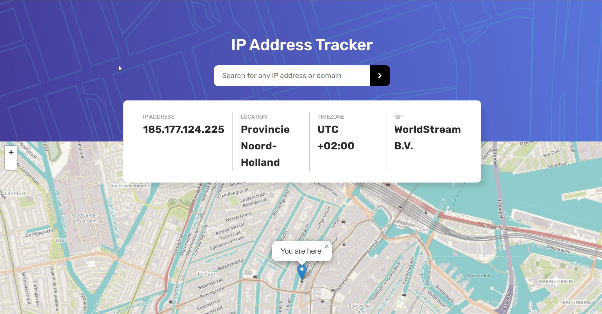

# Frontend Mentor - IP address tracker solution

This is a solution to the [IP address tracker challenge on Frontend Mentor](https://www.frontendmentor.io/challenges/ip-address-tracker-I8-0yYAH0). Frontend Mentor challenges help you improve your coding skills by building realistic projects. 

## Table of contents

- [Overview](#overview)
  - [The challenge](#the-challenge)
  - [Screenshot](#screenshot)
  - [Links](#links)
  - [Built with](#built-with)
  - [What I learned](#what-i-learned)
  - [Continued development](#continued-development)
  - [Useful resources](#useful-resources)
- [Author](#author)

**Note: Delete this note and update the table of contents based on what sections you keep.**

## Overview

### The challenge

Users should be able to:

- View the optimal layout for each page depending on their device's screen size
- See hover states for all interactive elements on the page
- See their own IP address on the map on the initial page load
- Search for any IP addresses or domains and see the key information and location

### Screenshot

### Links

- Solution URL: [Add solution URL here](https://github.com/samuel-jarvis/ip-address-tracker)
- Live Site URL: [Add live site URL here](https://ip-address-tracker-psi-olive.vercel.app/)

### Built with

- Semantic HTML5 markup
- CSS custom properties
- Flexbox
- Javascript

### What I learned

* I learned how to use APIs for a project.
* Error Handling
* Writing Helper Functions
* Promises

### Useful resources

- [Leaflet Library](https://leafletjs.com/index.html) - I used this API to render maps
- [IP Geolocation API](https://geo.ipify.org/docs) - I used this API to get IP address and other details like longitude and latitude for rendering the map

## Author

- Website - [Samuel Jarvis Adeyemi](https://www.your-site.com)
- Frontend Mentor - [@samuel-jarvis](https://www.frontendmentor.io/profile/samuel-jarvis)
- Twitter - [@SamJarvis244](https://twitter.com/SamJarvis244)

